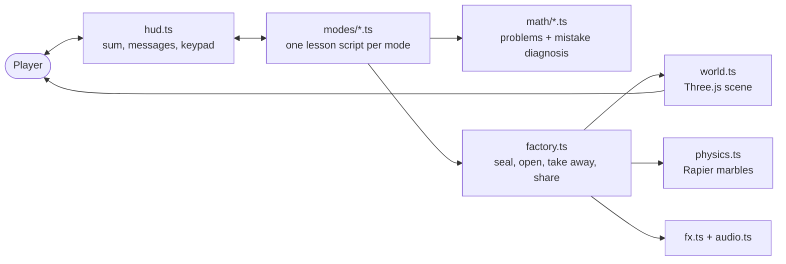

# Hesabu Lab

A 3D physics math game about **place value**: 10 marbles (ones) seal into 1 crate (a ten),
and a crate can be opened back into 10 marbles. Four modes, each with two levels:

| Mode | Idea | What happens |
|---|---|---|
| **+ Add** | carrying | Drop marbles; every full tube seals into a crate and the carried 1 appears |
| **− Take away** | borrowing | Not enough ones? Open a crate into the ten-frame rack; the tens digit is crossed out |
| **× Groups** | multiplication as equal groups | Add groups of marbles/crates; tens still seal as the total grows |
| **÷ Share** | division with remainder | Deal marbles to trucks; open crates when ones run out; leftovers go in the leftover tray |

Wrong answers are checked for the classic mistake behind them (forgot the carry, subtracted
the smaller digit from the larger, added instead of multiplying, swapped share and remainder)
and get a hint aimed at that mistake.

Play it at **https://hesabu-lab.pages.dev**. It works on computers, tablets and phones, upright or sideways.

## Run

```bash
pnpm install
pnpm dev        # play at http://localhost:5173
pnpm test       # maths logic tests
pnpm build      # static site in dist/
```

## 3D models (Blender, no GUI needed)

```bash
blender --background --python blender/crate.py
blender --background --python blender/truck.py
```

Each writes a model to `public/models/` and a preview render to `blender/previews/`.
Shared helpers are in `blender/common.py`.

## Architecture



More diagrams (project structure, build and deploy pipeline, module dependencies, a round of
play, the frame loop and the phone layouts) are in [`docs/ARCHITECTURE.md`](docs/ARCHITECTURE.md).

## Code map

| File | What it does |
|---|---|
| `src/math/*.ts` | Problem generators + mistake diagnosis per operation (pure logic, tested; to be ported to Rust/WASM) |
| `src/modes/*.ts` | One short script per game mode, reading like the lesson it teaches |
| `src/factory.ts` | Shared mechanics: build a number, seal a crate, open a crate, take away, share to trucks |
| `src/world.ts` | Three.js scene: lights, glow, tube, shelf, ten-frame rack, truck rail, gears, model loading |
| `src/physics.ts` | Rapier (Rust→WASM) marble physics in the tube |
| `src/marbles.ts` | Marble look, shared by physics and display marbles |
| `src/fx.ts` | Tweens, particles, camera shake |
| `src/audio.ts` | Synthesised sound effects (no audio files) |
| `src/hud.ts` | Maths panel, messages, action buttons, keypad |
| `src/main.ts` | Startup, mode menu, round loop, levels |

Add `?test` to the URL to allow large animation time steps (for slow headless play-testing).

## Deploy

Every push and pull request is type-checked, tested and built by GitHub Actions
(`.github/workflows/ci.yml`). Pushes to `main` that pass are deployed to Cloudflare Pages.
`vite.config.ts` uses `base: "./"`, so `dist/` also works from any sub-path or inside an `<iframe>`.

## License

Copyright © 2026 Felix Makinda.

Hesabu Lab is free software: you can redistribute it and/or modify it under the terms of the
**GNU Affero General Public License v3.0 or later** (see [`LICENSE`](LICENSE)). In short: you
may use, study, change and share it, but if you run a modified version for others (including
over the web) you must publish your changes under the same license.

Third-party pieces keep their own licenses: Three.js (MIT), Rapier (Apache-2.0), and the
Baloo 2 font (SIL Open Font License, loaded from Google Fonts).
