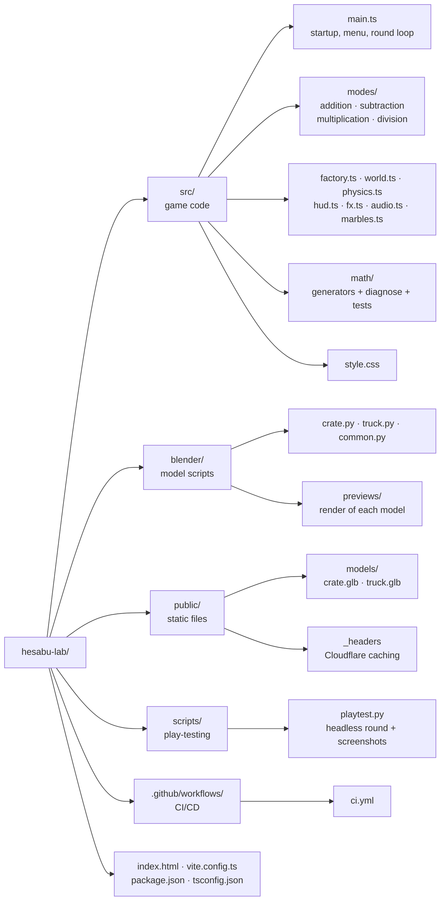
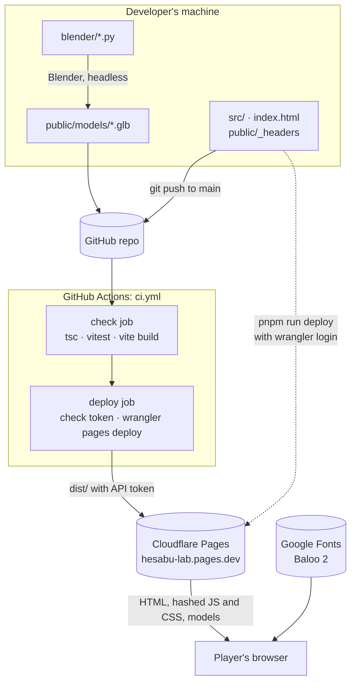
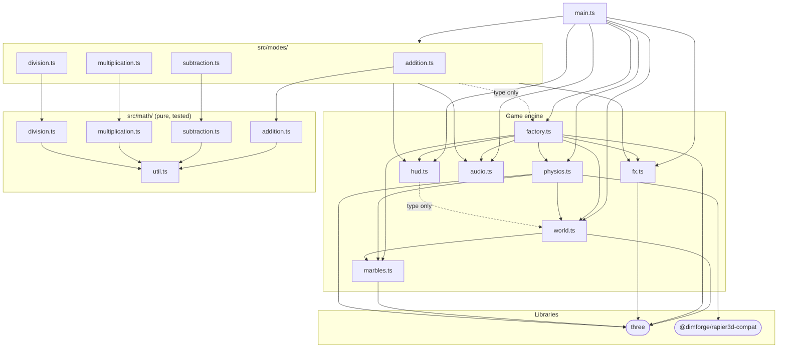
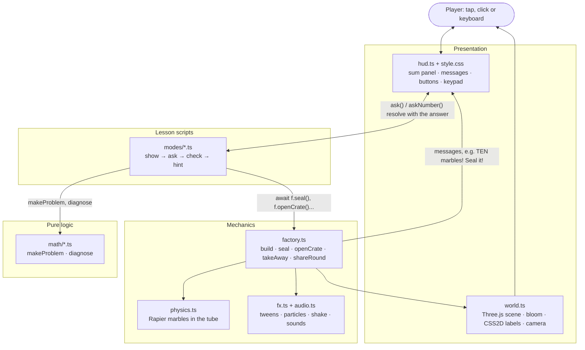
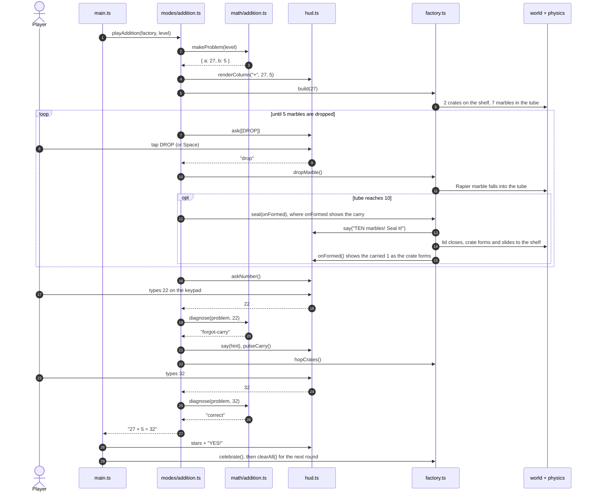
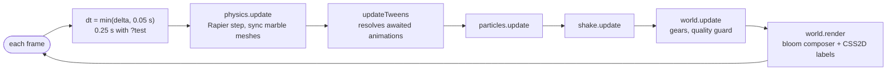
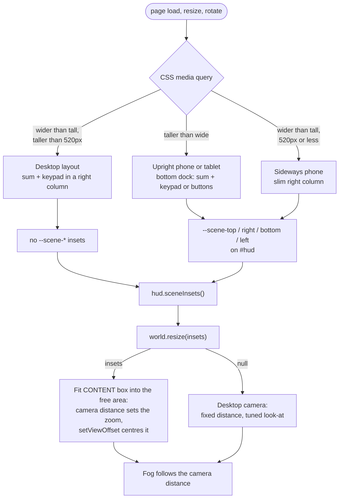

# Hesabu Lab architecture

Hesabu Lab is a static web app: TypeScript, Three.js for the 3D scene and Rapier (a Rust physics
engine compiled to WebAssembly) for the marbles. There is no server or database. Everything runs
in the player's browser.

The diagrams below use [Mermaid](https://mermaid.js.org/), which GitHub renders automatically.

1. [Project structure](#1-project-structure)
2. [From source to the player's browser](#2-from-source-to-the-players-browser)
3. [Module dependencies](#3-module-dependencies)
4. [Layers and responsibilities](#4-layers-and-responsibilities)
5. [One round of play](#5-one-round-of-play)
6. [The frame loop](#6-the-frame-loop)
7. [Screen layouts and camera framing](#7-screen-layouts-and-camera-framing)

## 1. Project structure

| Folder | Role |
|---|---|
| `src/math/` | Pure maths logic with no graphics: problem generators and `diagnose*` functions that name the mistake behind a wrong answer. Unit-tested with Vitest. |
| `src/modes/` | One script per game mode. Each reads like the lesson: show, ask, check, hint. |
| `src/factory.ts` | Shared game mechanics that modes call: build a number, seal a crate, open a crate, take away, share to trucks. |
| `src/world.ts` | The Three.js scene, lights, bloom, layout constants and camera framing. |
| `src/physics.ts` | Rapier marble physics inside the tube. |
| `src/hud.ts` | Everything in the DOM: written sum, messages, action buttons, keypad. |
| `src/fx.ts` · `src/audio.ts` | Tweens, particles, camera shake, and synthesised sound effects. |
| `blender/` | Python scripts that build the 3D models headlessly in Blender. |
| `scripts/playtest.py` | Plays a full round in headless Chromium on desktop, phone or tablet screens. |

## 2. From source to the player's browser

Pull requests run only the `check` job. Pushes to `main` that pass are deployed with the
`CLOUDFLARE_API_TOKEN` and `CLOUDFLARE_ACCOUNT_ID` repo secrets. A manual `pnpm run deploy`
uses your own `wrangler login` session instead, so it works even when the CI token doesn't.
Vite gives the built JS and CSS a content hash in their file names, and `public/_headers`
lets browsers keep the hashed JS and CSS for a year, keep models for a day, and always re-check
the HTML so updates appear straight away.

## 3. Module dependencies

Arrows point from a module to what it imports.

Two rules keep this tidy:

- `src/math/` imports nothing from the rest of the game, so it can be tested on its own and
  later ported to Rust/WASM without touching the graphics.
- Modes never touch Three.js or Rapier directly. They call `Factory` for anything physical and
  `hud` for anything written, so each mode script reads like the lesson it teaches.

## 4. Layers and responsibilities

## 5. One round of play

An addition round, for example 27 + 5. The other modes follow the same pattern with different
mechanics (open a crate, take away, add a group, share to trucks).

After 3 correct answers at level 1, `main.ts` moves the player to level 2 (bigger numbers).

## 6. The frame loop

`main.ts` drives one loop through `renderer.setAnimationLoop`. Mode scripts run alongside it as
`async` functions: `await wait(0.5)` and `await f.seal()` resolve when the loop has advanced
the matching tweens.

The quality guard in `world.update` measures the frame rate for the first few seconds. If it is
under 40 fps, it lowers the render resolution in steps, down to 1× on phones.

## 7. Screen layouts and camera framing

CSS decides where the HUD goes. The camera then fits the 3D scene into whatever space is left.

